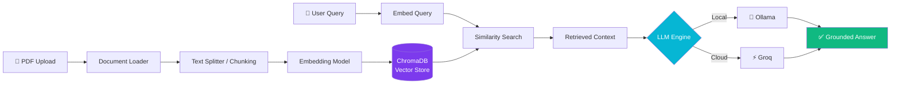

<!-- ====================== ANIMATED HEADER ====================== -->
<div align="center">


<!-- Typing animation -->
<a href="https://github.com/hotachandrakant/CKHAI-ASSISTANT">
  
</a>

<br/>

<!-- Badges -->
<p>
  
  
  
  
  
  
</p>

<p>
  
  
  
  
</p>

</div>

---

## 🧠 Overview

**CKHAI-ASSISTANT** is a production-grade **Retrieval-Augmented Generation (RAG)** system that lets you **chat with your own documents**. Upload PDFs, ask questions in plain English, and get accurate, context-grounded answers — with the underlying LLM running **fully offline via Ollama** or in the **cloud via Groq** for blazing-fast inference.

> Built for privacy, speed, and real deployment — not just a notebook demo.

<div align="center">

```
  📄 Documents  ──▶  ✂️ Chunking  ──▶  🔢 Embeddings  ──▶  🗄️ Vector Store
                                                                  │
  💬 Answer  ◀──  🤖 LLM  ◀──  🔍 Semantic Retrieval  ◀──────────┘
```

</div>

---

## 🏗️ Architecture



---

## ✨ Features

| | Feature | Description |
|---|---------|-------------|
| 🔒 | **Local-First Privacy** | Run the entire pipeline offline with Ollama — your documents never leave your machine |
| ⚡ | **Cloud Acceleration** | Switch to Groq for ultra-low-latency inference when you need speed |
| 🦜 | **LangChain Orchestration** | Robust RAG pipeline for loading, chunking, embedding, and retrieval |
| 🗄️ | **Vector Search** | ChromaDB for fast, persistent semantic similarity search |
| 🚀 | **FastAPI Backend** | Clean, async REST API ready for production deployment |
| 📄 | **Document Q&A** | Upload PDFs and ask natural-language questions with grounded answers |
| 🔄 | **Pluggable LLMs** | Swap between local and cloud models with a config change |

---

## 🛠️ Tech Stack

<div align="center">

| Layer | Technology |
|-------|-----------|
| **API** | FastAPI · Uvicorn |
| **RAG Framework** | LangChain |
| **Vector DB** | ChromaDB |
| **LLM (Local)** | Ollama |
| **LLM (Cloud)** | Groq |
| **Language** | Python 3.10+ |

</div>

---

## 🚀 Getting Started

### 📋 Prerequisites

- Python 3.10+
- [Ollama](https://ollama.com) installed and running (for local mode)
- A [Groq API key](https://console.groq.com) (optional, for cloud mode)

### ⚙️ Installation

```bash
# 1. Clone the repository
git clone https://github.com/hotachandrakant/CKHAI-ASSISTANT.git
cd CKHAI-ASSISTANT

# 2. Create & activate a virtual environment
python -m venv venv
source venv/bin/activate        # On Windows: venv\Scripts\activate

# 3. Install dependencies
pip install -r requirements.txt

# 4. Configure environment variables
cp .env.example .env            # then add your GROQ_API_KEY if using cloud mode
```

### ▶️ Running the App

The system runs **three concurrent processes**. Open three terminals (or use a process manager):

```bash
# Terminal 1 — start ChromaDB
chroma run --port 8000

# Terminal 2 — start Ollama (local LLM)
ollama serve

# Terminal 3 — launch the FastAPI server
uvicorn app:app --host 0.0.0.0 --port 8080 --reload
```

Then open **http://localhost:8080/docs** to explore the interactive API.

---

## 📡 API Endpoints

| Method | Endpoint | Description |
|--------|----------|-------------|
| `POST` | `/upload` | Upload a PDF document for indexing |
| `POST` | `/ask` | Ask a question against the indexed documents |
| `GET`  | `/health` | Service health check |

> 💡 Adjust the table above to match your actual route names.

---

## 🗺️ Roadmap

- [x] Local RAG pipeline with Ollama
- [x] Cloud inference with Groq
- [x] FastAPI + ChromaDB integration
- [ ] Streaming responses
- [ ] Multi-document collections & namespaces
- [ ] Web UI front-end
- [ ] Docker Compose one-command deploy

---

## 🤝 Contributing

Contributions, issues, and feature requests are welcome! Feel free to open an issue or submit a PR.

---

## 👤 Author

<div align="center">

**Chandrakant Hota**

[](https://github.com/hotachandrakant)
[](https://www.linkedin.com/in/hotachandrakant)

*Data Science & Full Stack Engineering*

</div>

---

## 📝 License

This project is licensed under the **MIT License** — see the [LICENSE](LICENSE) file for details.

<!-- ====================== ANIMATED FOOTER ====================== -->
<div align="center">


⭐ **If you find this project useful, consider giving it a star!** ⭐

</div>
