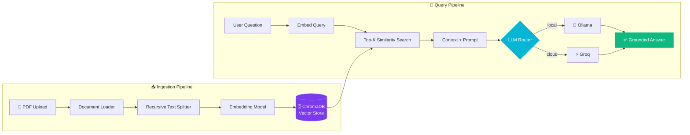

<!-- ==================== ANIMATED 3D BANNER ==================== -->
<div align="center">



<!-- Typing animation -->
<a href="https://github.com/hotachandrakant/CKHAI-ASSISTANT">
  
</a>

<br/><br/>

<!-- Tech badges -->
<p>
  
  
  
  
  
  
</p>

<p>
  
  
  
  
  
</p>

</div>

<!-- Animated divider -->


## 🧠 What is CKHAI-ASSISTANT?

**CKHAI-ASSISTANT** is a production-grade **Retrieval-Augmented Generation (RAG)** system that turns any pile of PDFs into a conversational knowledge base. Upload your documents, ask questions in plain English, and get **accurate, source-grounded answers** — no hallucinated guesses.

The killer feature: it runs **100% offline** on your own machine via **Ollama**, so sensitive documents never leave your device — or flips to **Groq** in the cloud when you want answers at lightning speed.

> 💡 Not a notebook toy — a real FastAPI service with a vector store, retrieval pipeline, and swappable LLM backends.

<br/>

<div align="center">

| 🔒 Private by default | ⚡ Cloud when you need it | 📄 Grounded answers | 🚀 Production-ready API |
|:---:|:---:|:---:|:---:|
| Local LLM via Ollama | Groq for low latency | Cites your own docs | FastAPI + async |

</div>


## 🏗️ System Architecture




## ✨ Features

| | Feature | Description |
|---|---------|-------------|
| 🔒 | **Local-First Privacy** | Full pipeline runs offline with Ollama — documents never leave your machine |
| ⚡ | **Cloud Acceleration** | One config switch to Groq for ultra-low-latency inference |
| 🔄 | **Pluggable LLM Backends** | Local ↔ cloud with zero code changes |
| 🦜 | **LangChain Orchestration** | Battle-tested load → chunk → embed → retrieve pipeline |
| 🗄️ | **Persistent Vector Search** | ChromaDB keeps embeddings across restarts |
| 📄 | **Source-Grounded Q&A** | Answers are anchored to retrieved chunks, not made up |
| 🚀 | **Async FastAPI Backend** | Clean REST API with auto-generated Swagger docs |
| 🧩 | **Configurable Retrieval** | Tune chunk size, overlap, and top-K from one place |


## 🛠️ Tech Stack

<div align="center">


| Layer | Technology |
|-------|-----------|
| **API / Server** | FastAPI · Uvicorn |
| **RAG Framework** | LangChain |
| **Vector Database** | ChromaDB |
| **LLM — Local** | Ollama |
| **LLM — Cloud** | Groq |
| **Language** | Python 3.10+ |

</div>


## 📂 Project Structure

```
CKHAI-ASSISTANT/
├── assets/
│   └── banner.svg          # Animated banner
├── app.py                  # FastAPI entry point
├── rag/
│   ├── ingest.py           # Load, chunk & embed documents
│   ├── retriever.py        # Vector similarity search
│   └── llm.py              # Ollama / Groq router
├── data/                   # Uploaded source documents
├── chroma_db/              # Persistent vector store
├── .env.example            # Environment template
├── requirements.txt
└── README.md
```
> 📝 Adjust file/folder names to match your actual layout.


## 🚀 Getting Started

### 📋 Prerequisites
- Python **3.10+**
- [Ollama](https://ollama.com) installed & running — for local mode
- A [Groq API key](https://console.groq.com) — optional, for cloud mode

### ⚙️ Installation

```bash
# 1 — Clone
git clone https://github.com/hotachandrakant/CKHAI-ASSISTANT.git
cd CKHAI-ASSISTANT

# 2 — Virtual environment
python -m venv venv
source venv/bin/activate          # Windows: venv\Scripts\activate

# 3 — Dependencies
pip install -r requirements.txt

# 4 — Environment
cp .env.example .env              # add GROQ_API_KEY if using cloud mode
```

### ▶️ Run (3 concurrent services)

```bash
# Terminal 1 — Vector store
chroma run --port 8000

# Terminal 2 — Local LLM
ollama serve

# Terminal 3 — API server
uvicorn app:app --host 0.0.0.0 --port 8080 --reload
```

Open **http://localhost:8080/docs** for the interactive Swagger UI. 🎉


## ⚙️ Configuration

| Variable | Description | Default |
|----------|-------------|---------|
| `LLM_PROVIDER` | `ollama` or `groq` | `ollama` |
| `OLLAMA_MODEL` | Local model name | `llama3` |
| `GROQ_API_KEY` | Groq cloud key | — |
| `CHUNK_SIZE` | Tokens per chunk | `1000` |
| `CHUNK_OVERLAP` | Overlap between chunks | `200` |
| `TOP_K` | Chunks retrieved per query | `4` |
> Map these to your real settings/env names.

## 📡 API Endpoints

| Method | Endpoint | Description |
|--------|----------|-------------|
| `POST` | `/upload` | Upload & index a PDF |
| `POST` | `/ask` | Ask a question over indexed docs |
| `GET`  | `/health` | Service health check |


## 🗺️ Roadmap

- [x] Local RAG pipeline with Ollama
- [x] Cloud inference with Groq
- [x] FastAPI + ChromaDB integration
- [ ] Streaming token responses
- [ ] Multi-document collections / namespaces
- [ ] Web UI front-end
- [ ] Docker Compose one-command deploy

## 🤝 Contributing

Contributions, issues, and feature requests are welcome — open an issue or submit a PR.


## 👤 Author

<div align="center">

**Chandrakant Hota**

[](https://github.com/hotachandrakant)
[](https://www.linkedin.com/in/hotachandrakant)

*Data Science & Full Stack Engineering*

</div>

## 📝 License

Licensed under the **MIT License** — see [LICENSE](LICENSE) for details.

<div align="center">

⭐ **If this project helped you, drop a star!** ⭐


</div>
